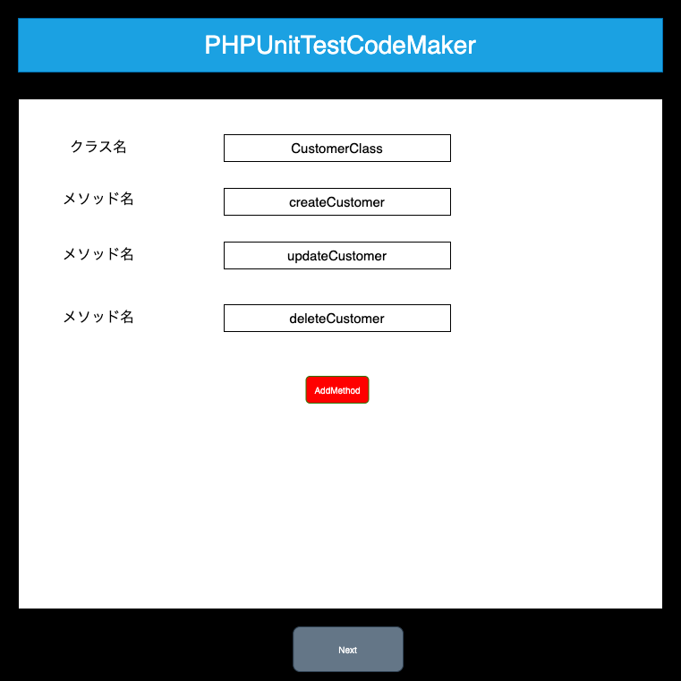
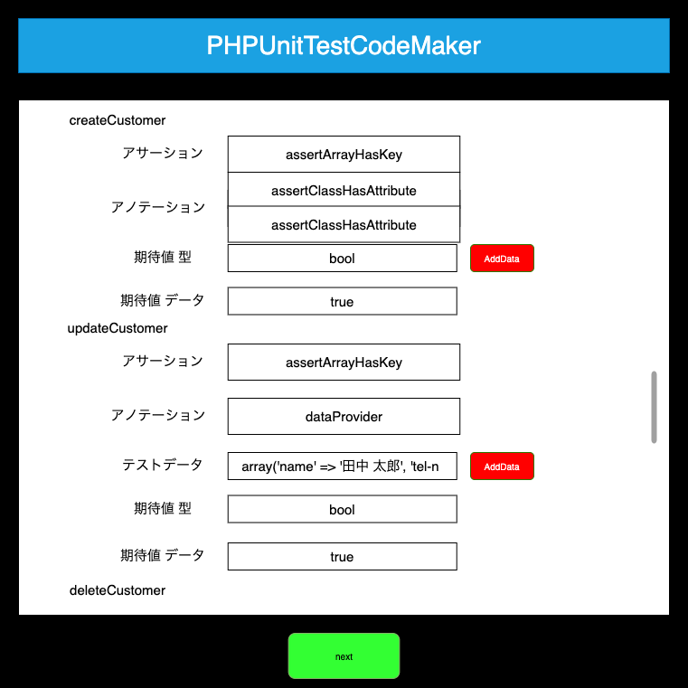
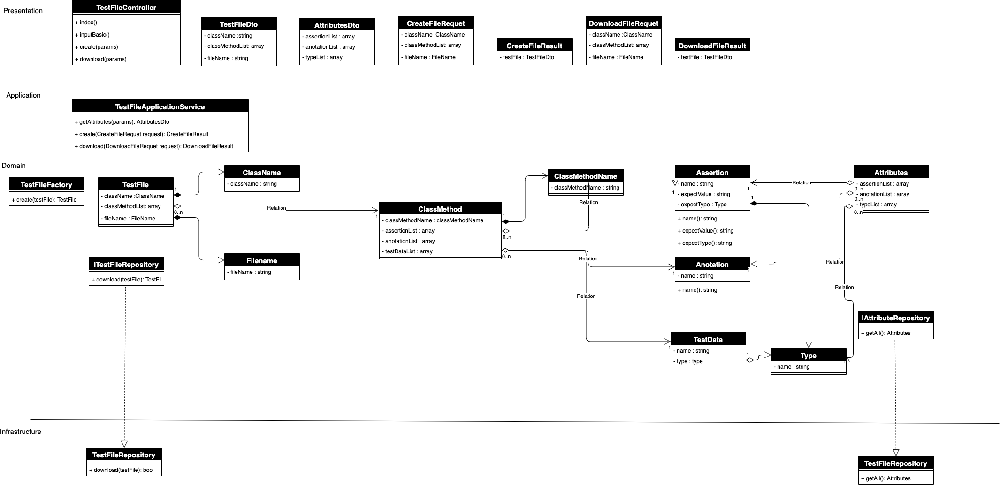

# PHPUnitTestCodeMaker

画面上から必要な項目を入力してPHPUnitのテストコードを作成することができる。

## 使用方法
1. テスト対象のクラス名とクラスメソッド名を入力する。

1. アサーション、アノテーション、テストデータを入力する。

2. テストコードを画面で確認、ファイルをダウンロードすることができる。

## クラス図

## swagger
[swaggerリンク](https://bellcrud.github.io/PHPUnitTestCodeMaker/dist/index.html#/default/post-testfile)